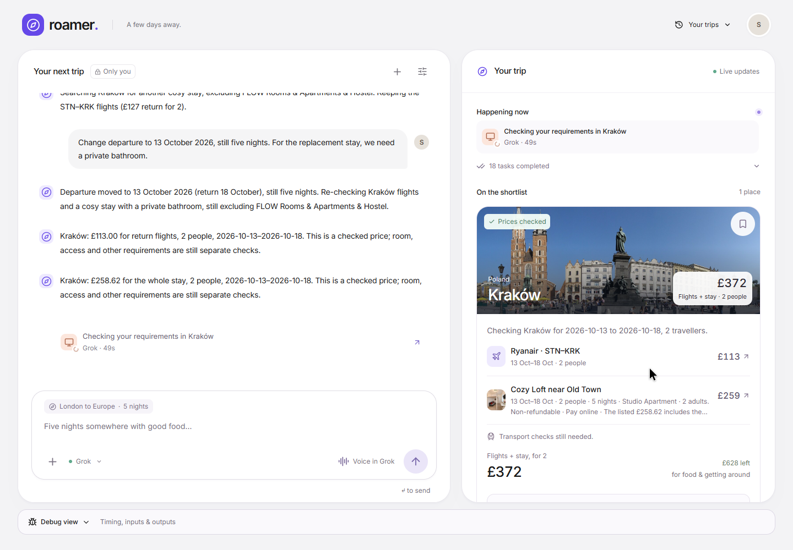
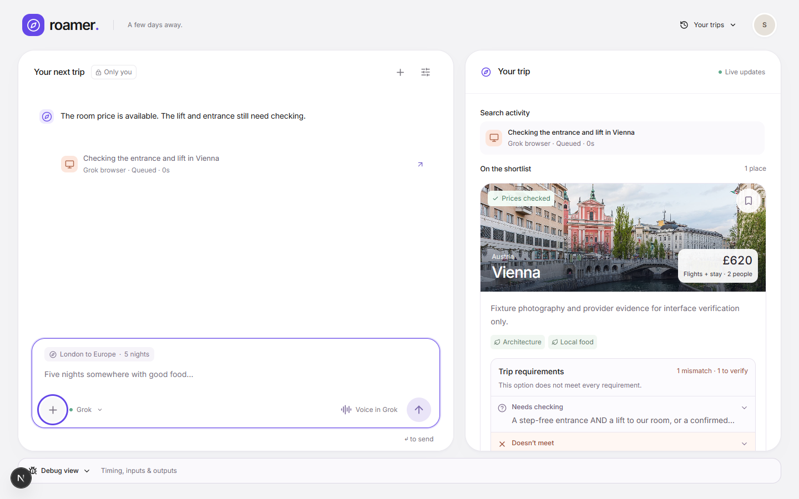
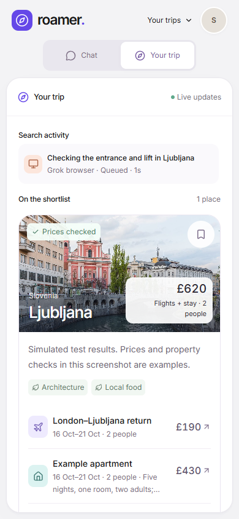

# Roamer

A private travel workspace with Grok Bot conversation, structured questions, live research activity and dated flight/accommodation comparisons.

[Open the demo](https://roamer-chi.vercel.app) · [Setup](SETUP.md) · [Worker documentation](src/worker/README.md)

The hosted demo requires a private access code. Roamer asks for missing trip details, keeps the conversation beside a visual shortlist, and shows which provider is working. Supabase persists the conversation and research events. Tavily and Apify handle searches; a local Grok Bot worker handles conversation and direct browser checks.

## Product video

[](https://raw.githubusercontent.com/silmoon04/roamer/a1995cd4071c28cb72128c737a8bcde6e24f20e4/docs/video/roamer-demo.mp4)

[Watch or download the 61-second demo](https://raw.githubusercontent.com/silmoon04/roamer/a1995cd4071c28cb72128c737a8bcde6e24f20e4/docs/video/roamer-demo.mp4) · [Recording notes](docs/demo-video.md) · [Measured live run](docs/LIVE-RUN.md)

Actual service footage with waiting shortened and labelled. Later preference changes appear in the saved conversation and results, rather than every click being captured. Prices arrived while conversation continued; transport and suitability checks remained partial. Native voice is not shown or verified.

## Screenshots

These screenshots use synthetic test fixtures to demonstrate the interface. The displayed price is not a live travel offer, and the fixture destination image is not location evidence.





## Submission status

The latest deterministic test run passed **241 tests**, with nine opt-in live tests skipped, and TypeScript checks passed. Tests cover intake, event ordering, stale results, question answers, workspace isolation, provider normalization, model reply parsing, personal reset links and recovery states. Read the [recovery verification](docs/RECOVERY-VERIFICATION.md) for the live intake failure and its repair. Live provider calls remain slower than the demo target. A checked fare or room price does not confirm that accessibility, bed layout or every traveller preference is suitable.

Native Grok voice synchronisation is **unverified**. Voice remains in the Grok app; no OpenAI API key is required. A consistently completed shortlist within three minutes and a verified replay backup are still unfinished. Debug view exposes inputs, outputs, queue time, task runtime and update timing to make those issues inspectable.

## Open your personal workspace

The hosted app is [roamer-chi.vercel.app](https://roamer-chi.vercel.app). Open the local private launcher at `.roamer/Open Roamer.html` for the personal handoff. Keep that file private: it contains access details and is excluded from version control. The launcher contents are not part of the public documentation.

The personal entry now opens a fresh conversation with no confirmed budget, dates, destination or saved preferences. Earlier personal trips are archived. The existing submitted link resolves to the fresh trip through an owner-scoped alias; new messages and subsequent reloads use the current trip. A reset preserves the old records for recovery and never forwards their pending commands to the new bots.

Your conversation uses **Roamer Personal**. Direct browser checks use the separate **Roamer Personal Research** bot, so a long browser task does not occupy your conversation bot. The laptop worker and signed-in Grok desktop app are still required even when the website is hosted on Vercel.

Automated tests use dedicated tester workspaces and bots. Read [personal testing notes](docs/PERSONAL-TESTING.md) for the earlier handoff evidence and limitations. Native spoken voice synchronisation has not been verified.

The personal workspace hides the debug panel. Designated tester workspaces retain **Debug view**, with **Timing & tasks**, **Inputs & outputs** and **Your feedback**. **Save testing note** records a comment with the tester trip without sending it to Grok. **Export JSON** includes sanitized debug records and browser timing samples. The panel refreshes every five seconds while open; a dash means no timing sample exists yet. Queue wait, running time, database update delay and bridge delay are separate measurements.

## Run locally

Node 24 is used for the web app and local worker.

```powershell
npm ci
npm run dev
```

In a second terminal, while the Grok desktop app is signed in:

```powershell
npm run worker
```

Open http://127.0.0.1:3000. The private access code is `ROAMER_ACCESS_CODE` in the ignored `.env.local`. The web app signs into its dedicated Supabase demo user; all trip rows have owner-scoped read policies. Only server routes and the laptop worker may write.

The laptop worker must remain running for Grok messages and live searches. Reloading the website restores the saved trip. An offline laptop is shown in the composer and queued messages remain saved.

## How it works

- Next.js serves the workspace and authenticated command routes.
- Supabase stores trip snapshots, events, commands, traveller preferences and worker heartbeats. Realtime delivers changed trip state; polling repairs missed updates.
- The laptop worker uses the pinned community `grok-bot-cli` bridge with the existing Grok desktop session. The desktop credentials never go to Vercel or the browser.
- Roamer Personal chooses questions and destinations. Validated `<roamer>` JSON blocks become UI events. Website text is rendered as plain text, not HTML.
- Tavily supplies source discovery. Apify supplies dated flights and stays. Grok’s browser is used for checks that need direct browsing, such as access to a stay and a walk without a car.
- Native voice stays in the Grok app. Use Roamer Personal with this website beside it. A spoken test is required to verify that voice updates reach this conversation; text and clicked-answer tests do not establish voice support. No OpenAI key is used.

The first version stops at a shortlist and source/booking links. It does not reserve, purchase or enter payment information. The displayed total covers flights and the whole stay for the specified party; food, local transport and optional extras remain outside it.

## Bot and preference isolation

| Workspace | Conversation bot | Browser checks |
| --- | --- | --- |
| `personal` | Roamer Personal | Roamer Personal Research |
| `stress-careful` | Dedicated careful-couple tester bot | Its registered research bot |
| `stress-slower` | Dedicated slower-travel tester bot | Its registered research bot |
| `stress-friends` | Dedicated friends tester bot | Its registered research bot |

The server-owned `roamer_workspaces` registry supplies each new trip's bot IDs and saved preferences. Trip bindings are fixed at creation. Replies to website commands must match the appropriate bot, trip and requested task. Each bot has its own execution lane and heartbeat; research providers still share bounded capacity.

Conversation sends and active reply checks take priority over background transcript polling. Unused tester bots stay idle, while recently active bots are checked less frequently after their work finishes. These changes reduce competing bridge requests; the recorded video timings predate this polling update.

History defaults to `personal`. Tester histories require their explicit workspace selection, and tester preferences do not become personal preferences. Earlier shared Travel Agent trips remain readable but reject new commands. This is operational separation within one private demo account, not separate accounts for multiple users.

## Configuration

`.env` contains the existing Tavily key. `.env.local` contains the Supabase project configuration, private demo login and primary Apify token. See `.env.example` for names. Never commit either file.

Vercel receives the two browser-safe Supabase values, the server service key and dedicated demo account configuration. Tavily, Apify and Grok session credentials remain on the laptop.

The schema is recorded in `supabase/migrations`. This project uses the cloud database, so Docker is not required. `scripts/setup-local.mjs` provisions the private demo account for a new configured project and imports the explicitly authorised primary Apify key from the sibling misc folder. It does not print credentials.

## Checks

```powershell
npm run typecheck
npm test
npm run test:e2e
npm run build
```

The browser suite uses Chrome, a running local server and isolated Supabase trip records. Keep the queue worker stopped during this suite so fixture messages are not sent to Grok. The suite removes only the test trips it created. Real-service scenario runs are separate and are recorded in the test report.

At the personal handoff, the full unit run recorded **135 passes**; nine opt-in live queue tests were skipped. Seven live API/database isolation checks passed, and a separate rolled-back transaction confirmed preference isolation. The personal workspace and debug panels were inspected at **390 and 1440 pixels**, with no horizontal overflow or browser JavaScript errors. Saving feedback was checked on a disposable tester trip; the personal trip was left unchanged. These checks do not establish a completed live shortlist or spoken voice support on the new bots.

Opt-in database queue tests use `stress-careful` and refuse to run while a fresh worker heartbeat is present. Earlier scenario scripts and browser fixtures can enqueue real work; review their workspace selection before running them again. Coordinate live stress runs with anyone using the private demo.

Browser screenshots, traces and measured timings are written under the ignored `output/playwright` directory. Raw provider receipts are private local files under `.roamer`; application results contain only the fields needed for comparison and source checking.

Personal handoff screenshots and browser inspection reports are in `output/personal/`. The live isolation receipt is `output/tests/workspace-isolation.json`. Baseline stress reports are in `output/stress/`; they describe the earlier shared-bot implementation and must not be cited as measured performance of the new isolated bots.

## Service limits

Flight actor: `kaix/google-flights-scraper`. Stay actor: `voyager/booking-scraper`. Requests are limited to a small result set, two concurrent actors, 150 seconds per actor and a $0.25 per-run charge cap. Provider failures remain visible and may be retried. Uncertain Grok message delivery is not automatically resent.

The bridge is a community integration tied to the installed desktop app. Its version is pinned. Re-run the real conversation checks after upgrading either side.
